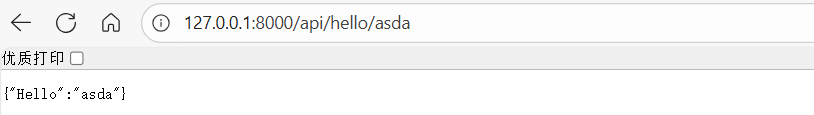
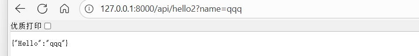
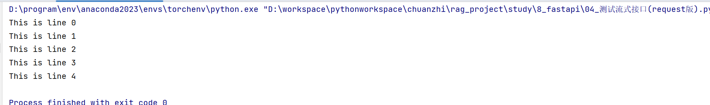

## 简介

FastAPI 是一个用于构建 API 的现代、高性能的 Python Web 框架。它以其**极快的开发速度**和**高性能的运行效率**而闻名。

**关于前端后端客户端**

举例说明

~~~
<!-- 最常见的客户端：浏览器 -->
谷歌浏览器、火狐浏览器、Safari等

组成：
- 浏览器软件本身
- 运行在其中的前端代码(HTML/CSS/JS)
- 用户界面
~~~


## 安装

```python
pip install fastapi	
```

## 极简示例                                                                                                                                                                                                                                                                                                                                                                                                                                                                                                                                                                                                                                                                                                                                                                                                                                                                                                                                                                                                                                                                                                                                                                                                                                                                                                                                                                                                                                                                                                                                                                                                                                                                                                                                                                                                                                                                                                                                                                                                                                                                                                                                                                                                                                                                                                                                                                                                                                            

```python
from fastapi import FastAPI

app = FastAPI()
@app.get("/")
def hello():
    return {"Hello": "World"}

if __name__ == '__main__':
    import uvicorn
    uvicorn.run(app, host="127.0.0.1", port=8000)
```

## get方法接参

```python
from fastapi import FastAPI

app = FastAPI()

# 方法 1
@app.get("/api/hello/{name}") # 直接在路径中提取参数
def hello(name):
    return {"Hello": name}

# 方法 2
@app.get("/api/hello2")
def hello2(name):
    '''
    通过在路径中?key=value的形式传参
    例如http://127.0.0.1:8000/api/hello2?name=qqq
    '''
    return {"Hello": name}

if __name__ == '__main__':
    import uvicorn
    uvicorn.run(app, host="127.0.0.1", port=8000)
```


- 方法1访问示例：


- 方法2访问示例：



## post方法传参

使用pydantic作为post方法的形参。

- Pydantic 是一个用于 **数据验证和设置管理** 的 Python 库，它主要利用 Python 的**类型提示** 来在执行过程中验证数据的类型、结构和约束。

- 通俗来说：就是专门用来定义数据类型的

示例：

```python
from fastapi import FastAPI
from pydantic import BaseModel # 导入pydantic的basemodel

class Query(BaseModel):
    query: str
    session_id: str

app = FastAPI()

# 简单的同步流式文本响应
@app.post("/chat")
def query(query: Query):
    # 确保返回的是异步生成器
    return {"query":query.query,"session_id":query.session_id}

if __name__ == "__main__":
    import uvicorn
    # /docs打开前端
    uvicorn.run(app, host="127.0.0.1", port=8000)
```

## 接口文档

fastapi可展示现成的接口文档，这是它相较flask的一个巨大优势。

支持两种形式：

### Swagger UI (默认)

- **访问路径**: `/docs`

  可以直接在页面上测试 API 接口


### ReDoc

- **访问路径**: `/redoc`

  非交互式，仅展示，对于绝大多数人而言更美观


## 流式输出

1. 示例

```python
from fastapi import FastAPI
from fastapi.responses import StreamingResponse # 导入流式响应
import time

app = FastAPI()

# 假设一个每秒生出一行文本的生成器函数
def generate_text():
    for i in range(5):
        time.sleep(1)
        yield f"This is line {i}\n"


@app.get("/chat")
def stream_text():
    # 确保返回的是流式生成器
    return StreamingResponse(generate_text(),media_type="text/plain")

if __name__ == "__main__":
    import uvicorn
    # /docs打开前端
    uvicorn.run(app, host="127.0.0.1", port=8000)
```

2. 测试

注意，流式响应后，/docs的swagger接口文档测试是无法体现流式效果的，前端也许有响应的流式接收。若后端要测，则可使用requests, 示例如下：

```python
import requests

url = 'http://127.0.0.1:8000/chat'

r = requests.get( url,stream=True)

# 流式打印
for chunk in r:
    print(chunk.decode('utf-8'), end="", flush=True)
```



会每秒输出一行

## 跨域


**跨域** 指的是一个网页的 JavaScript 代码试图访问来自**不同源**（协议、域名、端口任一不同）的服务器资源时，浏览器出于安全考虑会默认阻止这种请求。

通俗理解：后端起的服务，无论是flask还是fastapi，前端默认是访问不了的。(除非直接是本地的前端浏览器)


**FastApi处理**：

```python
from fastapi import FastAPI
from fastapi.middleware.cors import CORSMiddleware # 导入CORS中间件

app = FastAPI()
app.add_middleware(
    CORSMiddleware,
    allow_origins=["*"],  # 允许所有域名, 若生成环境则指定域名 例如 ["https://www.example.com"],这指的是前端服务器所在域名，也可以是ip地址
    allow_credentials=True, # 允许携带cookie
    allow_methods=["*"],  # 允许所有方法 方法指的是 get post put delete 等
    allow_headers=["*"],  # 允许所有头 头是指请求头 例如 Content-Type, Authorization 等
)

@app.get("/")
def hello():
    return {"Hello": "World"}

if __name__ == '__main__':
    import uvicorn
    uvicorn.run(app, host="127.0.0.1", port=8000)
```


