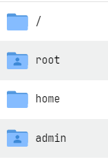

# 目录

这是 Linux 系统的核心目录结构，为了快速跳转界面将一些层级结构平行展示。

## 1. **/ (根目录)**

- **作用**：整个文件系统的起点，所有其他目录都挂载在根目录下
- **包含内容**：
  - 系统核心文件和目录
  - 系统启动所需的文件
  - 所有用户目录的父目录

## 2. **/root**

- **作用**：**超级管理员（root用户）** 的专属家目录
- **特点**：
  - 只有 root 用户可以完全访问
  - 存放 root 用户的个人文件、配置和脚本
  - 普通用户无法访问
- **你的位置**：你现在就在这个目录下（从之前的命令提示符可以看出）

## 3. **/home**

- **作用**：**普通用户的家目录** 的父目录
- **包含内容**：
  - 每个普通用户都有一个以用户名命名的子目录
  - 例如：`/home/admin`、`/home/user1` 等
- **特点**：
  - 用户登录后默认进入自己的家目录
  - 用户对自己的家目录有完全控制权
  - 存放用户的个人文件、配置、文档等

## 4. **/home/admin**

- **作用**：**admin 用户的家目录**
- **包含内容**：
  - admin 用户的个人文件
  - 用户特定的配置文件（如 `.bashrc`）
  - 用户安装的软件、项目文件等
- **权限**：admin 用户对此目录有完全控制权

~~~
/
├── root/          # root用户的家目录 (你现在在这里)
├── home/          # 所有普通用户的家目录
│   └── admin/     # admin用户的家目录
├── etc/           # 系统配置文件
├── var/           # 可变数据文件
├── usr/           # 用户程序和数据
└── bin/           # 系统命令
~~~

