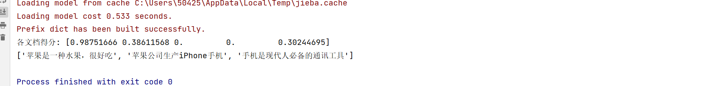
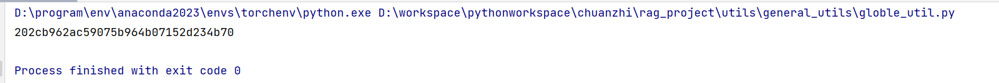

## Pyhon日志

### 核心概念

- **日志级别**

  ：表示日志的重要性，常见级别从低到高：

  - `DEBUG`：调试信息（最低）
  - `INFO`：一般信息
  - `WARNING`：警告，可能有问题
  - `ERROR`：错误，已影响程序
  - `CRITICAL`：严重错误（最高）

- **日志处理器（Handler）**：决定日志输出到哪里（如控制台或文件）

- **日志格式（Formatter）**：定义日志的显示样式（如时间、级别、消息）


## bm25

**BM25（Best Matching 25）** 是信息检索领域中最经典且广泛应用的排名算法之一， 由TF-IDF的演化而来。

核心特点: 平衡**词频(TF)**、**逆文档频率(IDF)** 和**文档长度归一化**三个因素有机结合，既考虑词项的重要性，又避免单一因素的过度影响。


### 公式

$$
BM25(D,Q) = \sum_{i=1}^n \frac {(k₁ + 1) \cdot f_i}  {f_i + k₁ \cdot (1 - b + b\cdot\frac {|D|} {avgdl})}·log(\frac {N-n_i+0.5} {n_i+0.5} +1)
$$

其中：

> - fi 是词项 qi在文档 D中的出现次数（TF），
> - N是文档总数，
> - ni是包含词项 qi的文档数，
> - ∣D∣是文档 D的长度，
> - avgdl 是所有文档的平均长度，
> - k1 和 b是调整参数，通常设置为 k1=1.2和 b=0.75 。


### IDF部分

$log(\frac {N-n_i+0.5} {n_i+0.5} +1)$ 这个部分是IDF也就是逆文档词频部分。

传统IDF公式: $IDF(qi)=log⁡(\frac {N} {n_i})$

两种公式都遵循**逆文档频率**的核心原理：

- **常见词**（$n_i$大）→ **权重低**
- **罕见词**（$n_i$小）→ **权重高**

对比分析：

- **当 $n_i$ 很小时（罕见词）：→ 接近传统IDF，给予高权重**

$$
\frac {N-n_i+0.5} {n_i+0.5} ≈\frac {N} {n_i}
$$


- **当 $n_i$ 很大时（常见词）：** → 给予低权重
  $$
  \frac {N-n_i+0.5} {n_i+0.5} ≈\frac {0.5} {n_i} （很小的值）
  $$


- **+0.5 **的作用：
  - 避免除零错误（当 $n_i = 0$ 时）
  - 避免 $\log(0)$ 的情况

- **+1** 的作用：避免负的IDF值 (log零点几会是负数)


### TF部分

#### 传统TF的问题

- 简单计数：$f_i$
- 容易受长文档影响（长文档词频自然高）
- 没有饱和机制（只是简单的线性加权)

#### BM25的TF改进

**分子：** $(k₁ + 1) \cdot f_i$

- 放大词频的影响

**分母：** $f_i + k₁ \cdot (1 - b + b\cdot\frac {|D|} {avgdl})$

- $f_i$：词频本身

- $k₁ \cdot (1 - b + b\cdot\frac {|D|} {avgdl})$：**归一化因子**


若忽略所有调整系数，则公式意义是：

$$
TF = \frac {fi} {fi+归一化因子}
$$

#### 归一化因子的作用

**$b\cdot\frac {|D|} {avgdl}$**：文档长度归一化

- $|D|$：当前文档长度
- $avgdl$：平均文档长度
- $\frac {|D|} {avgdl}$ > 1：长文档，惩罚
- $\frac {|D|} {avgdl}$ < 1：短文档，奖励

**$(1 - b)$**：保证当 $b=0$ 时也能正常工作

**$k₁$**：控制饱和度的参数

- $k₁$ 小：快速饱和（出现2-3次就达到最大效果）, K越小，长度因子对TF值的影响就越大，所以快速饱和。
- $k₁$ 大：慢速饱和，K越大，长度因子对TF值的影响就越小，所以慢速饱和。

辅助理解公式(只看K的影响)：

$$
TF = \frac {K·fi} {fi+K}
$$


### Python工具

#### 安装

```python
pip install rank_bm25 jieba
```

#### 示例

```python
from rank_bm25 import BM25Okapi
import jieba

# 文档集合
corpus = [
    "苹果是一种水果，很好吃",
    "苹果公司生产iPhone手机",
    "香蕉是黄色的水果",
    "水果市场有很多种水果",
    "手机是现代人必备的通讯工具"
]

# 中文分词处理
tokenized_corpus = [list(jieba.cut(doc)) for doc in corpus]
# 创建BM25模型
bm25 = BM25Okapi(tokenized_corpus)

# 查询
query = "苹果手机"
tokenized_query = list(jieba.cut(query))

# 计算得分
doc_scores = bm25.get_scores(tokenized_query)
print("各文档得分:", doc_scores)

# 获取排名前N的结果
top_n = bm25.get_top_n(tokenized_query, corpus, n=3)
print(top_n)
```



#### 要点

- 要先分词再使用`BM25Okapi`

- 文档得分是会按照源文档顺序展示


## hash

### 简介

给定任意长度的文本，能快速计算将其转换为32长度的字符串，该字符串被称为哈希值。

**特点**

1. 同样的文本得到的哈希值是一样的，所以很适合用作去重。
2. 哈希值无法逆向推出源文本，所以无法用作压缩解压功能。

### 使用

```python
import hashlib

# 生成hash值
def gen_hash(text):
    return hashlib.md5(text.encode('utf-8')).hexdigest()

print(gen_hash("123"))
```




## uuid

### 简介

- **全称**：通用唯一识别码
- **核心特点**：**全球唯一**。理论上，在所有时空范围内，每一个生成的 UUID 都是独一无二的，几乎不可能重复。
- **标准格式**：通常用 32 个十六进制数字表示，并以连字符分成五组:
  - 例如：`f47ac10b-58cc-4372-a567-0e02b2c3d479`
- **用途**：当你需要为数据库中的记录、分布式系统中的组件、文件、会话等任何东西生成一个绝对不会与其他实例冲突的标识符时，UUID 是理想选择。


### uuid4

UUID4 是 UUID 标准中的第 4 个版本。

虽然理论上有重复的可能，但随机空间极其巨大（约 5.3 x 10³⁶ 种可能），在实际应用中重复的概率可以忽略不计。

### 使用

```python
import uuid
# 生成一个 UUID4
my_uuid = uuid.uuid4()
print(my_uuid)  # 输出： f47ac10b-58cc-4372-a567-0e02b2c3d479
print(type(my_uuid))  # <class 'uuid.UUID'>
# 如果你想以字符串形式获取（不带连字符）
uuid_string = my_uuid.hex
print(uuid_string)  # 输出： f47ac10b58cc4372a5670e02b2c3d479
# 也可直接转换为string
uuid_str = str(my_uuid)
print(uuid_str) # 输出： f47ac10b-58cc-4372-a567-0e02b2c3d479
```


